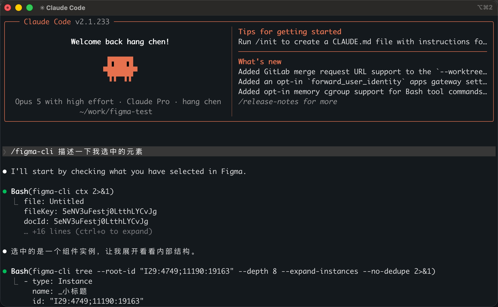
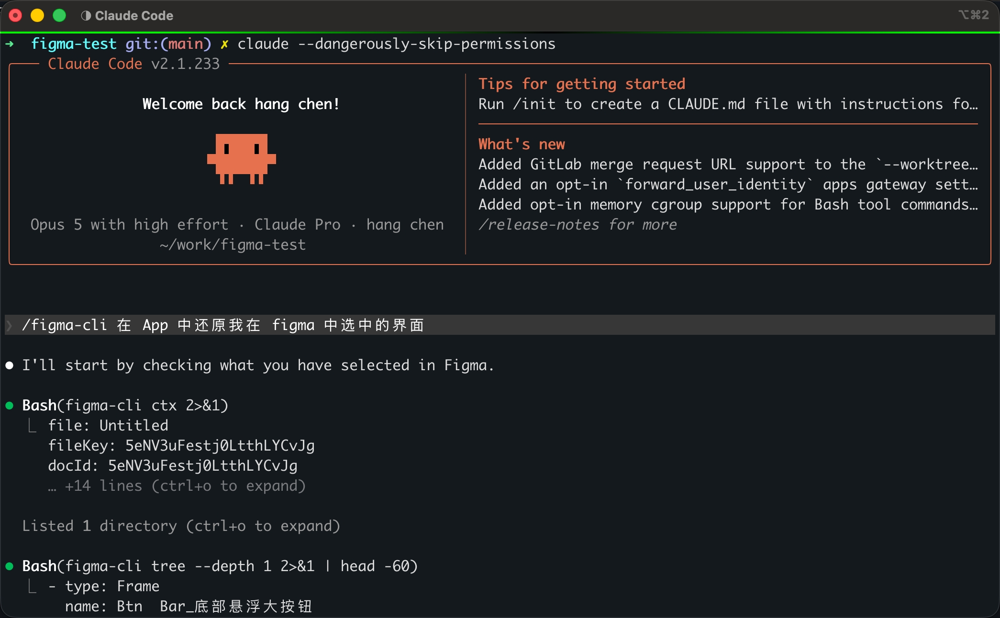

# figma-cli

自建的 Figma → AI 通道。通过 **Figma 插件**直接读本地打开的设计文档，经 WebSocket 交给常驻 **daemon**，`figma-cli` 命令把设计稿以低 token、保留 design token 语义的形式交给 AI 模型。

由于走的是 Plugin API 而不是 REST API，所以**没有速率限制（figma-cli 存在的主要原因）**，官方的 figma mcp 每天的限额非常低。


使用示例：





---

## 快速开始

**前置条件**：Node ≥ 20、Figma 桌面版。

### 1. 安装

```bash
curl -fsSL https://raw.githubusercontent.com/hanschencoder/figma-cli/main/scripts/install.sh | bash
```


**仓库会留在本地。** 全局的 `figma-cli` 命令和各工具的 skill 都是指向仓库里文件的软链。

skill 会自动扫描并链进这些工具的 skill 目录，**装了哪个链哪个**，没装的跳过：

| 工具 | 目录 |
|---|---|
| Claude Code | `~/.claude/skills` |
| Cursor | `~/.cursor/skills` |
| Codex | `~/.codex/skills` |
| Gemini CLI | `~/.gemini/skills` |
| GitHub Copilot CLI | `~/.copilot/skills` |
| 通用 | `~/.agents/skills` |

### 2. 在 Figma 里导入插件

Figma 桌面版 → `Plugins` → `Development` → `Import plugin from manifest...`，选中 `packages/plugin/manifest.json`（默认安装在 `~/.figma-cli/src/packages/plugin/manifest.json`，安装脚本最后会把完整路径打出来）。导入后在 `Plugins → Development → Figma CLI Bridge` 运行，插件面板会显示连接状态。

只需导入一次。更新后**关掉插件窗口重开**即可。

验证：

```bash
figma-cli --help
figma-cli status
```

### 3. 用起来

```bash
figma-cli ctx                      # 看用户选中了什么
figma-cli plan 1:3635              # 还原一个页面前的一站式调研
figma-cli tree --depth 3           # 只要结构
figma-cli image 1:3635             # 导出截图
figma-cli vars --used-by 1:3635    # 这个子树用到的 design token
```

daemon 在第一条命令时自动拉起并常驻，不需要手动管理。

---

## 更新

```bash
curl -fsSL https://raw.githubusercontent.com/hanschencoder/figma-cli/main/scripts/install.sh | bash
```

## 卸载

```bash
curl -fsSL https://raw.githubusercontent.com/hanschencoder/figma-cli/main/scripts/install.sh | bash -s -- --uninstall
```

---

## 命令清单

| 命令 | 规范名 | 说明 |
|---|---|---|
| `figma-cli docs` | `list_documents` | 列出已连接的 Figma 文档 |
| `figma-cli use <docId>` | `select_document` | 多文档时指定目标 |
| `figma-cli ctx` | `get_current_context` | 文件/页面/当前选中项 —— **入口** |
| `figma-cli plan [id]` | `plan_page` | 还原前的一站式调研：结构 + 组件 + token + 切图清单 + 文案 + 走查 |
| `figma-cli tree [id...]` | `get_node_tree` | 分层展开结构，可一次给多个根 |
| `figma-cli find <关键词>` | `search_nodes` | 按名称/类型定位 |
| `figma-cli node <id>...` | `get_node_detail` | 完整属性 |
| `figma-cli text [id]` | `get_text_content` | 抽取全部文案 |
| `figma-cli image <id>` | `get_node_image` | 导出 PNG（给模型看的截图） |
| `figma-cli export <id...>` | `export_assets` | 切图：PNG/JPG/SVG/PDF、多倍率、落到项目目录 |
| `figma-cli lint [id]` | `lint_design` | 设计走查：裸色值、裸字号、被 detach 的实例、不在刻度表里的间距… |
| `figma-cli css <id>` | `get_node_css` | Auto Layout → flex CSS 的机械翻译 |
| `figma-cli vars` | `get_variables` | 变量集合与各 mode 的值 |
| `figma-cli styles` | `get_styles` | Paint / Text / Effect / Grid |
| `figma-cli components` | `get_components` | 组件与变体清单 |

CLI 也接受规范名（`figma-cli get_node_tree` 等价于 `figma-cli tree`）。每条命令 `--help` 看完整参数。

daemon 管理：

| 命令 | 说明 |
|---|---|
| `figma-cli status` | daemon 端口、pid、已连接文档 |
| `figma-cli stop` | 停止 daemon（改了 server 代码后必须执行，否则跑的还是旧进程） |
| `figma-cli daemon` | 前台运行 daemon，看实时日志 |

多文档时不会静默猜测目标：只有一个连接时自动使用；多个连接且未指定时报错并列出候选，先 `figma-cli use <docId>`。

---

## 输出格式

stdout 恒为合法 YAML（日志和附注走 stderr 或 `#` 注释行），可以直接接 `yq`：

```yaml
- type: Frame
  name: ProductCard
  id: "12:34"
  size: [340, 420]
  layout: {mode: vertical, gap: 16, padding: 20}
  fill: $surface/card
  radius: 12
  effect: $elevation/1
  children:
    - type: Text
      name: title
      id: "12:37"
      text: AirPods Pro
      size: [300, 24]
      color: $color/text-primary
      font: {style: "@text/heading-sm"}
```

- `$name` 是**变量**（variable），`@name` 是**样式**（style）。能还原成 token 引用的一律不出原始值。
- 默认值、Auto Layout 流内的坐标、与内容重复的图层名等无意义字段不写；短结构走 flow 风格。
- 图标 / 系统控件 / 结构同构的相邻兄弟会折叠成一行（`type: Icon` / `type: SystemInset` / `sameAs`），折叠后原始 id 仍可检索。三种折叠分别可用 `--expand-icons` / `--expand-system` / `--no-dedupe` 关掉。

---

## 架构

```
AI（读 skill 后调用命令）
   │  figma-cli tree --depth 3
   ▼
figma-cli CLI ──HTTP POST /call──►  daemon（常驻）
                                  │  内嵌 WS Server + HTTP /health
                                  │  ws://localhost:3055~3064
                                  ├───────────────►  Plugin@文档A
                                  └───────────────►  Plugin@文档B
                                                        │  figma.ui.postMessage
                                                        ▼
                                                    Plugin Sandbox ──► figma.*
```

插件沙箱能调 `figma.*` 但没有网络，插件 UI（iframe）有网络但碰不到 `figma.*`，且不能监听端口 —— 所以链路是三段式，中间必须有常驻 daemon。插件侧只做字段裁剪产出中间 JSON，YAML 序列化、折叠、走查、CSS、plan 都在 daemon 侧。

```
figma-cli/
├─ packages/
│  ├─ shared/     协议类型定义（两端共用）
│  ├─ server/     daemon + WS Hub + tools 注册表 + YAML 序列化 + 折叠/走查/CSS/plan + cli.ts 前端
│  └─ plugin/     manifest.template.json（构建生成 manifest.json）+ code.ts（沙箱）+ ui.html/ui.ts
├─ skills/figma-cli/  给 AI 的使用说明（软链进各工具的 skills 目录）
│  └─ scripts/           svg2vd.sh + 内置的 Svg2Vector（lib/，只需 JRE 11+）
└─ scripts/       install.sh 一键安装/更新 · smoke.mjs 全链路冒烟
   └─ vd/         Svg2Vd.java + build-deps-jar.sh + 回归样例（维护者用，不随 skill 分发）
```

技术栈：TypeScript · `@figma/plugin-typings` · esbuild · npm workspaces

---

## 排查

- `figma-cli status` —— daemon 端口、pid、已连接文档
- `~/.figma-cli/daemon.log` —— daemon 的输出（自动拉起时看这里）
- `~/.figma-cli/daemon.json` —— 当前 daemon 的端口与 pid
- `curl http://localhost:3055/health` —— 直接看 daemon 状态
- 插件面板的「日志」按钮展开活动日志
- `npm run smoke` —— 假插件跑全链路，不需要打开 Figma，用来区分是 daemon 侧还是 Figma 侧的问题

环境变量：

| 变量 | 说明 |
|---|---|
| `FIGMA_CLI_PORT` | 固定端口（CLI 也只认这个端口，用于测试隔离） |
| `FIGMA_CLI_LOG_LEVEL` | `debug` / `info` / `warn` / `error`，日志走 stderr |

用户配置 `~/.figma-cli/config.json`：`systemComponents` 可追加系统控件图层名，命中的子树折叠成 `SystemInset`。

---

## 当前范围

已支持：设计稿 → 代码（skill 面向 Android：Compose / View）、设计系统提取、切图、设计走查。

v1 不做：写操作（创建/修改节点、变量 CRUD）、Dev Mode 深度集成、CI / 无头运行、Library 变量的批量镜像同步、多客户端并存下的 daemon 抢占、任意 JS 执行。

v2 计划：批量改稿（按走查结果替换文案、裸值换 token）、AI 生成设计稿。协议的 method 命名空间已为写操作留位（`node.get*` → `node.set*`）。

**不做鉴权。** localhost WebSocket 上本机任何进程都能连上端口读设计稿，v1 全部接口只读、不出网。引入写操作时会重新评估。

---

## 参考

- [southleft/figma-console-mcp](https://github.com/southleft/figma-console-mcp)
- [Figma Plugin API](https://www.figma.com/plugin-docs/)
